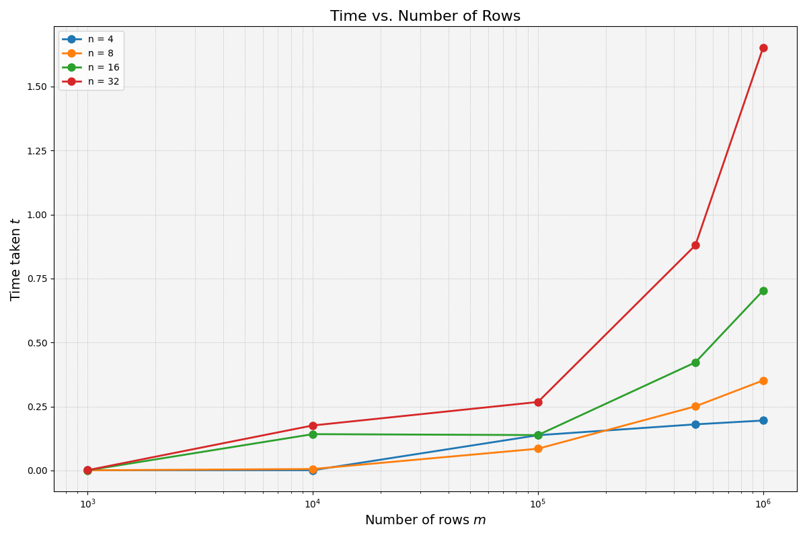

# Case Studies in High-Performance Computing

## Assignment 1 - Communication-Avoiding Methods

### C Implementation

#### How the Implementation Follows the Mathematical Background

We explain how our `tsqr()` method follows the mathematical background:

1. **Matrix Partioning and Distribution**:

    - **Global Matrix Generation**: On the root process, a random global matrix $A$ of size $m\times n$ is generated (`A_global`). This matrix represents the tall and skinny matrix to be factorised.

    - **Partitioning via `MPI_Scatter()`**: The total number of rows $m$ is divided evenly among the available MPI processes (with each process handling `local_rows = m / size`). The function uses `MPI_Scatter()` to distribute contiguous blocks (row partitions) of $A$ from the root process to all processes. Each process receives its local block (`A_local`), simulating the matrix partioning across processors.

2. **Local QR Factorisation**:

    - **Local Copy and Factorisation**: Each process copies its received local block into a working array (`local_factor`). Then, it computes the local QR factorisation by called `LAPACKE_dgeqrf()`, which returns both the local Householder reflectors and the upper triangular factor implicitly in `local_factor`.

    - **Extracting the Local $R$ Factor**: From the output of `LAPACKE_dgeqrf()`, each process extracts its local $R$ (`R_local`) by iterating over the local block and zeroing out the lower triangular part.

    - **Forming the Local $Q$ Factor**: The local $Q$ factor (`Q_local`) is computed by applying the Householder reflectors via `LAPACKE_dorgqr()` on the same local block. At this point, each process has:

      - A local orthogonal matrix $Q$.

      - A local upper triangular matrix $R$.

3. **Reduction Step**:

    - **Gathering Local $R$ Factors**: The local $R$ matrices (each of size $n\times n$) from all processes are gathered on the root process using `MPI_Gather()`. This creates a stacked $R$ matrix of size $4n\times n$ (`R_stack`).

    - **Global $QR$ on the Stacked $R$ Matrix**: On the root process, a second $QR$ factorisation is applied to the stacked $R$ matrix using `LAPACKE_dgeqrf()`. This yields:

      - The final upper triangular matrix $R$ of size $n\times n$ (`R_final`).

      - An intermediate orthogonal matrix `Q_red_all` (after using `LAPACKE_dorgqr()`), which acts as the reduction factor that combines the local $Q$ factors.

    - **Broadcasting the Global Reduction $Q$**: The matrix `Q_red_all` is then broadcasted from the root process to all other processes using `MPI_Bcast()`, so every process can update its local $Q$ factor.

4. **Constructing the Final $Q$**:

    - **Extracting $Q$ Reduction Blocks**: Each process extracts its corresponding `Q_red_block` (a block of size $n\times n$) from `Q_red_all`. This block corresponds to the global reduction associated with that process's portion of the matrix.

    - **Updating the Local $Q$ Factor**: Each process then multiplies its local $Q$ by its `Q_red_block` using `cblas_dgemm()`. This operation updates the local $Q$ to incorporate the global reduction, yielding `Q_local_final`.

    - **Gathering the Final Global $Q$**: Finally, all processes send their `Q_local_final` back to the root process via `MPI_Gather()`, which constructs the complete orthogonal matrix `Q_final_global` of size $m\times n$.

5. **Verification**: This step relates to `tsqr.c` since `timing.c` writes timing results to `timing.txt`.

    - **Reconstruction of the Original Matrix**: On the root process, the reconstructed matrix is computed by multiplying the final orthogonal matrix with the final upper triangular matrix using `cblas_dgemm()`.

    - **Residual Norm Calculation**: The accuracy of the factorisation is verified by computing $||A-QR||$, where $Q$ is `Q_final_global` and $R$ is `R_final`. This is calculated by iterating over the elements of the original matrix and the reconstructed matrix, summing the squared differences, and finally taking the square root.

    - **Output**: The code prints the original matrix, the final orthogonal matrix, the final upper triangular matrix, the reconstructed matrix, and the computed residual norm to confirm the correctness of the factorisation.

### Graph to Show Scaling of Algorithm

We present the graph obtained from running `timing.c`:

We can divide the explanation of the scaling properties seen above into three headings:

1. **Increasing $m$**: For each fixed $n$, the runtime grows as $m$ increases. This makes sense because each MPI process performs a local QR factorisation on $\frac{m}{4}$ rows (assuming four processes, as is required for the assignment), which has a cost roughly proportional to $m\times\frac{n^2}{4}$. As $m$ grows, the local factorisation cost increases linearly in $m$.

2. **Increasing $n$**: Comparing the different lines for $n$ shows that, for the same $m$, larger $n$ leads to higher overall time. This is expected since QR factorisation is roughly $\mathcal{O}\left(m\times n^2\right)$ for the local blocks, and the final reduction step involves an $\mathcal{O}\left(n^3\right)$ operation on the stacked $R$ factors. As such, the time difference between $n=4$ and $n=32$ can be an order of magnitude or more.

3. **Communcation Overhead**: Due to the scattering and gathering of local $R$ factors, along with the broadcasting of the global reduction $Q$, the communication time can also increase for large $m$. However, in the scenario where $m\gg n$, the local factorisation cost tends to dominate the communication time.
